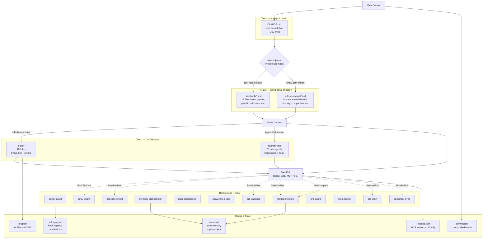

# Claude Code Configuration Architecture

> Source-of-truth spec for what `agent-transfer` should capture.
> Today the tool transfers `~/.claude/agents/` only. This document defines the full surface area
> of a sophisticated Claude Code setup and the transfer scope required to replicate it.

---

## TL;DR — the layered stack (ASCII)

```
┌─────────────────────────────────────────────────────────────────────────────┐
│                              USER PROMPT                                    │
└──────────────────────────────────┬──────────────────────────────────────────┘
                                   │
                                   ▼
        ┌───────────────────────────────────────────────────────┐
        │  TIER 1 — CORE (always loaded, ~200 lines)            │
        │  ~/.claude/CLAUDE.md                                  │
        └───────────────────────────────────────────────────────┘
                                   │
                                   ▼
        ┌───────────────────────────────────────────────────────┐
        │  TIER 2/3 — CONDITIONAL (PreToolUse hook injection)   │
        │  ~/.claude/rules/tools/<tool>.md     (per-tool)       │
        │  ~/.claude/rules/domains/<domain>.md (per-path)       │
        │  Injected by:  ~/.claude/hooks/rules-injector/        │
        └───────────────────────────────────────────────────────┘
                                   │
                ┌──────────────────┼──────────────────┐
                ▼                  ▼                  ▼
        ┌──────────────┐   ┌──────────────┐   ┌──────────────────┐
        │ TIER 4       │   │ SUB-AGENTS   │   │ BACKGROUND HOOKS │
        │ skills/*/    │   │ agents/*.md  │   │ hooks/*/         │
        │ explicit     │   │ spawned via  │   │ pre/post tool,   │
        │ /slash       │   │ Agent tool   │   │ session, compact │
        └──────────────┘   └──────────────┘   └──────────────────┘
                │                  │                  │
                └──────────────────┼──────────────────┘
                                   ▼
                          ┌──────────────────┐
                          │   TOOL CALL      │
                          │ Bash / Edit /    │
                          │ MCP / Read / ... │
                          └──────────────────┘
                                   │
                                   ▼
                ┌────────────────────────────────────┐
                │  PostToolUse hooks                 │
                │  retry-guard, prd-cadence,         │
                │  cascade-shield, batch-guard       │
                └────────────────────────────────────┘
                                   │
                                   ▼
                ┌────────────────────────────────────┐
                │  SessionEnd / PreCompact           │
                │  unified-memory, prd-diary,        │
                │  specstory-sync                    │
                └────────────────────────────────────┘
```

---

## Mermaid — full system



---

## Asset inventory — full transfer scope

| # | Asset | Path | Type | Notes / sensitivity |
|---|---|---|---|---|
| 1 | Constitution | `~/.claude/CLAUDE.md` | file | Tier 1 core — always-loaded behavioral spine |
| 2 | Rules — tools | `~/.claude/rules/tools/*.md` | dir of files | 19 files; hook-injected per tool |
| 3 | Rules — domains | `~/.claude/rules/domains/*.md` | dir of files | Hook-injected per cwd / path match |
| 4 | Skills | `~/.claude/skills/*/` | dir tree | 107 skills; each is a folder with `SKILL.md` + helper scripts |
| 5 | Agents | `~/.claude/agents/*.md` | dir of files | 73 sub-agent definitions (already supported) |
| 6 | Hooks | `~/.claude/hooks/*/` | dir tree | 12 subsystems; scripts + state dirs (state may be machine-specific) |
| 7 | Recipes | `~/.claude/recipes/` | dir + INDEX.md | 14 recipes + index for retry/recovery flows |
| 8 | Slash commands | `~/.claude/commands/` | dir | Custom user slash commands |
| 9 | Settings | `~/.claude/settings.json` | file | Hook registrations, permissions, env vars |
| 9b | Local settings | `~/.claude/settings.local.json` | file | Per-machine overrides (treat as machine-local) |
| 10 | MCP config (real) | `~/.claude.json` | file | **120 KB** — `mcpServers` key at line 333; contains tokens/paths |
| 10b | MCP config (legacy stub) | `~/.claude/mcp.json` | file | 905 B legacy file; usually safe to ignore |
| 11 | Auto-memory | `~/.claude/memory/` | dir | MEMORY.md + entries — **personal** |
| 11b | Per-project memory | `~/.claude/projects/*/memory/` | dir | Per-project memory entries — **personal** |
| 12 | Plugins | `~/.claude/plugins/` | dir | Installed plugins + marketplace cache |

### Sensitivity classes

| Class | Meaning | Default in archive |
|---|---|---|
| **Public** | Safe to share with a partner / team | Included by default |
| **Machine-local** | Will not work on another machine without rewrite (paths, hosts) | Included with rewrite warnings |
| **Secret** | Tokens, credentials, identity data | **Excluded** by default; opt-in via flag |
| **Personal** | Memory, preferences, identity | **Excluded** by default; opt-in via flag |

| Asset | Class |
|---|---|
| CLAUDE.md, rules/, skills/, agents/, recipes/, commands/ | Public |
| hooks/ (scripts) | Public |
| hooks/*/state/, hooks/*/cache/ | Machine-local — exclude |
| settings.json | Public (review hook paths after import) |
| settings.local.json | Machine-local — exclude by default |
| `~/.claude.json` mcpServers | Mixed — contains tokens; **redact-on-export** |
| memory/, projects/*/memory/ | Personal — exclude by default |
| .credentials.json | Secret — **never** include |
| plugins/ | Public (rebuildable from marketplace) — exclude by default |

---

## Transfer flow — proposed CLI

```
agent-transfer config export [scope] [flags]

Scopes (composable):
  agents              # current behavior (default if no scope given)
  rules               # CLAUDE.md + rules/{tools,domains}
  skills              # skills/* directories
  hooks               # hooks/* (scripts only, exclude state/cache)
  recipes             # recipes/ + INDEX.md
  commands            # commands/
  settings            # settings.json (NOT settings.local.json by default)
  mcp                 # ~/.claude.json mcpServers key (with token redaction)
  full                # everything Public + Machine-local with warnings

Flags:
  --include-memory          # add memory/ + projects/*/memory (Personal class)
  --include-secrets         # add tokens & credentials (DANGEROUS, refuse without --i-know)
  --include-local-settings  # add settings.local.json
  --redact-tokens           # default ON for mcp scope; replace token values with <REDACTED>
  --output FILE             # tarball name
  --manifest                # write a JSON manifest of what was included/excluded/redacted
```

### Import-side behavior

| Asset | Conflict policy | Special handling |
|---|---|---|
| `agents/` | existing diff-based resolver (already in tool) | unchanged |
| `skills/` | dir-level diff (per skill folder) | each skill is atomic; preview NEW/CHANGED/IDENTICAL like agents today |
| `rules/`, `recipes/`, `commands/` | file-level diff | same UX as skills/agents |
| `CLAUDE.md` | always 3-way prompt (incoming / local / merged) | NEVER auto-overwrite — too important |
| `hooks/` | dir-level diff + post-import `chmod +x` pass | warn if scripts reference paths that don't exist on importer's machine |
| `settings.json` | merge JSON (deep), not overwrite | hook paths must be rewritten relative to importer's `$HOME` |
| `~/.claude.json` (MCP) | merge `mcpServers` key only, leave the rest of file alone | placeholder tokens flagged for user to fill in |
| `memory/` (opt-in) | append-only — never overwrite existing entries | rewrite project paths if asked |

### Manifest format (`manifest.json` inside tarball)

```json
{
  "version": "0.2.0",
  "created_at": "2026-05-02T20:30:00Z",
  "source_host": "<hostname>",
  "scope": ["rules", "skills", "agents", "hooks", "recipes", "commands"],
  "included": {
    "rules/tools": 9,
    "rules/domains": 7,
    "skills": 107,
    "agents": 73,
    "hooks": 12,
    "recipes": 14
  },
  "excluded": [
    {"path": "hooks/retry-guard/state", "reason": "machine-local"},
    {"path": "memory/", "reason": "personal — pass --include-memory to include"},
    {"path": "~/.claude.json", "reason": "not in scope — pass `mcp` scope to include"}
  ],
  "redacted": [
    {"path": "rules/tools/atlassian.md", "key": "cloud_id", "reason": "machine-id leak"}
  ],
  "warnings": [
    "settings.json contains absolute paths; importer will rewrite to their $HOME",
    "3 skills reference scripts at /home/<src-user>/bin — review after import"
  ]
}
```

---

## Why each asset matters (the "rules flow" the user asked about)

The system isn't just files in folders — they wire together. A partner who only gets `agents/` lands on a machine where:

1. The constitution they reference (CLAUDE.md) doesn't exist → core behavior diverges.
2. Tool-specific guardrails (rules/tools/bash.md, gemini.md, etc.) don't fire → agents make the same mistakes the constitution was designed to prevent.
3. Skills the agents reference (`/sio-violations`, `/hh-discover`, `/done-before`) don't exist → agent prompts contain dangling slash-commands.
4. Hooks that enforce circuit-breakers (retry-guard, batch-guard, cascade-shield) don't run → agents loop on errors, fan out parallel calls that cascade-fail.
5. Recipes referenced by retry.md aren't present → `INDEX.md` lookup fails → agent falls back to "ask user."
6. MCP servers aren't configured → `mcp__*` tools don't exist → agents return tool-not-found.

**Transfer must include every layer that the layer above it references**, or the partner gets a broken-by-design setup.

---

## Anti-patterns to avoid in the transfer tool

- **Capturing absolute paths verbatim** — `/home/gyasisutton/...` will not exist on the importer's machine. All asset content must be scanned for the source `$HOME` and rewritten on import.
- **Bundling secrets** — `~/.credentials.json`, MCP `headers.Authorization`, OAuth refresh tokens. Hard-deny by default.
- **Bundling state** — `hooks/*/state/`, `cache/`, SQLite DBs (`~/.sio/sio.db`). State must rebuild on the importer's machine; bundling it pollutes their data.
- **Merging settings.json by overwrite** — hook registrations are additive; deep-merge with conflict resolution per key.
- **Auto-overwriting CLAUDE.md** — it's the importer's behavioral spine. Always 3-way prompt.

---

## Phased rollout proposal

| Phase | Scope | Risk |
|---|---|---|
| v0.2.0 | Add `rules/` + `skills/` + `recipes/` + `commands/` | Low — pure file copy with diff UX |
| v0.3.0 | Add `hooks/` (scripts only, exclude state) + path-rewrite pass | Medium — script content needs `$HOME` scrubbing |
| v0.4.0 | Add `settings.json` deep-merge + `~/.claude.json` `mcpServers` merge with token redaction | Medium-high — JSON merge edge cases, token-detection |
| v0.5.0 | Opt-in `memory/` + `--include-secrets` (gated) | Low — purely opt-in |
| v0.6.0 | `agent-transfer doctor` — verifies referenced skills, hooks, MCP servers actually exist post-import (extends current `validate-tools`) | Low |

---

## MCP runtime capture — the deeper transfer problem

`~/.claude.json` only describes **how to invoke** an MCP server. It does not describe **how to install** one. On this machine, classification of the 21 active servers shows the gap:

| Class | Count | Example | Transfer challenge |
|---|---|---|---|
| Absolute-path binary/script | 6 | `/home/gyasisutton/.nvm/.../bin/npx`, `/home/gyasisutton/.bun/bin/bunx` | Path won't exist on import |
| `uv run --directory <path>` | 5 | `uv run --directory ~/dev/some-mcp/ python -m server` | Local repo must exist on importer |
| `npx` (Node) | 3 | `npx -y @modelcontextprotocol/server-fetch` | Importer needs Node; package resolves on first run |
| HTTP / SSE transport | 3 | (no `command` field) | URL + auth headers — pure config, may contain tokens |
| `python` script | 1 | `/home/gyasisutton/dev/gemini-mcp/.venv/bin/python /home/gyasisutton/dev/gemini-mcp/server.py` | Local source + venv must be reproduced |
| `docker` | 1 | `docker run ...` | Importer needs Docker + image |
| `uvx` (Python isolated) | 1 | `uvx some-mcp-package` | Importer needs uv; package resolves on first run |
| `node` script | 1 | `node /path/to/local/server.js` | Local source + node_modules |

**Three failure modes** that breaking this down exposes:

1. **Absolute paths** — every entry that hard-codes `/home/gyasisutton/...` is broken on import. Even pip/npm-installable servers use absolute paths to the *runtime* (`/home/gyasisutton/.nvm/.../npx`).
2. **Local custom implementations** — `gemini-mcp`, custom `tableau-mcp`, etc. live in `~/dev/<repo>/`. The config points at them; the source code is separate.
3. **Runtime managers** — uv, bun, nvm, pyenv all install runtimes to user-local paths. Importer's machine will have *different* paths.

### Capture pipeline (`agent-transfer config export mcp`)

```
For each entry in ~/.claude.json mcpServers:
  1. CLASSIFY by inspecting `command` + `args`:
     - starts with /home/$USER/         → personal-path (rewrite needed)
     - command is `npx`/`uvx`/`bunx`    → registry-installable (record package name + version)
     - command is `uv run --directory`  → local-source (record path, check if git repo)
     - command is `docker`              → containerized (record image + tag)
     - command is `python`/`node` w/ script path → local-source (record dir + venv)
     - no command, has `url`/`type=sse` → http-transport (record URL, redact auth headers)

  2. CAPTURE the runtime:
     - registry-installable    → pin via `npm ls <pkg>` / `uv pip show <pkg>`
     - local-source            → bundle source tree (default) OR record git remote (--no-bundle-source)
     - containerized           → record image + tag (do NOT bundle the image)
     - http-transport          → record URL only, redact tokens

  3. REWRITE paths:
     - replace /home/$SRC_USER/ with $HOME placeholder
     - replace /home/$SRC_USER/.nvm/... with $(which npx) lookup at import time
     - replace /home/$SRC_USER/.bun/... with $(which bunx) lookup at import time
     - replace /home/$SRC_USER/.venv/... with venv-rebuild step in setup.sh

  4. EMIT mcp-manifest.json with one entry per server:
     {
       "name": "gemini-mcp",
       "class": "local-source",
       "source": {
         "type": "bundled",
         "tarball_path": "mcp-sources/gemini-mcp.tar.gz",
         "git_remote": "git@github.com:user/gemini-mcp.git",
         "git_sha": "<commit>"
       },
       "runtime": {
         "type": "python-venv",
         "python_version": "3.11",
         "requirements": ["mcp>=1.0", "google-genai>=0.3", ...]
       },
       "install_steps": [
         "tar -xzf mcp-sources/gemini-mcp.tar.gz -C $HOME/dev/",
         "cd $HOME/dev/gemini-mcp && python3.11 -m venv .venv && .venv/bin/pip install -r requirements.txt"
       ],
       "config_after_install": {
         "command": "$HOME/dev/gemini-mcp/.venv/bin/python",
         "args": ["$HOME/dev/gemini-mcp/server.py"]
       }
     }
```

### `agent-transfer init` — bootstrap flow on import

```
agent-transfer init [tarball.tar.gz] [flags]

Default behavior:
  1. Extract tarball to staging dir
  2. Read mcp-manifest.json, settings-manifest.json, etc.
  3. Generate setup.sh with all install steps + path-rewrites
  4. Print classified summary:
       - 12 servers ready to install (3 npx, 5 uvx, 4 local-source bundled)
       - 2 servers need user input (HTTP transport — paste auth tokens)
       - 1 server cannot auto-install (Docker — image not bundled, importer must `docker pull`)
  5. PROMPT: "Review setup.sh? [y/N/diff]"
       - 'y' → open in $EDITOR
       - 'diff' → show what would run
       - 'N' → skip review
  6. PROMPT: "Run setup.sh now? [yes/dry-run/abort]"
       - 'yes'     → execute (default; never silent)
       - 'dry-run' → echo every command without executing
       - 'abort'   → leave staged at ./agent-transfer-staging/

Flags:
  --yes              # skip both prompts (CI use); requires --i-accept-risks
  --no-bundle-source # at export-time: record git remotes instead of bundling source
  --setup-only       # generate setup.sh, do not run
  --skip <names>     # skip specific server installs
  --only <names>     # only install specific servers
```

### Why bundle source by default

Three options for custom local MCP servers, with trade-offs:

| Option | Pro | Con |
|---|---|---|
| **Bundle source** (default) | Works offline, deterministic, no external deps | Large tarball (10-100 MB per repo), licensing concern if shared |
| **Git remote only** (`--no-bundle-source`) | Small tarball, importer always gets latest | Importer needs SSH/HTTPS access; may break if remote moves |
| **Hybrid** (bundle + remote in manifest) | Best of both — fall back to remote if bundle missing | More complex resolution logic |

**Default = bundle**, with `--no-bundle-source` for partner-share scenarios where the importer has access to the same git remotes anyway.

### Setup-script safety rails

`setup.sh` is generated, never trusted. The flow:

1. Every command echoes itself before running (`set -x`).
2. Each step is idempotent — `pip install` uses `--upgrade` only with explicit flag, `git clone` checks if dir exists, `npm install` skipped if `package-lock.json` already matches.
3. Failures halt the script (`set -euo pipefail`); user sees exactly which step failed.
4. After successful install, run `agent-transfer doctor` to validate all MCP servers respond to the `mcp__server__list_tools` ping.
5. If any server fails health-check, surface the failure with the manifest entry that produced it — user knows whether to debug install or report a packaging bug.

### What does NOT get captured

- **Runtime managers themselves** — uv, bun, nvm, pyenv, Docker. The setup.sh checks they exist; if missing, prints "install uv first" with a link, then aborts. We don't try to bootstrap a developer's machine from scratch.
- **System-level deps** — libpq, openssl, build-essential. Out of scope; surface in `doctor` output if a build fails because of them.
- **OAuth refresh tokens / API keys** — `.credentials.json` is hard-denied. HTTP-transport `Authorization` headers are redacted to `<REDACTED>` and the importer must paste fresh values during init.

---

## Refinements after prototype validation (2026-05-03)

The classifier prototype (`agent_transfer/utils/mcp_classifier.py`) was run against the
real 21-server config. 100% classified, 0 unknowns. Key findings updated the spec:

### R1 — CLASS_BINARY is a fallback, not a primary class

The original spec listed "absolute-path binary/script" as one of 8 classes with its own capture
strategy. Reality: every absolute-path case in the wild was a runtime-manager-managed binary
(`~/.nvm/.../npx`, `~/.bun/bin/bunx`, `~/dev/<repo>/.venv/bin/python`) and was correctly
sub-classified as `registry-npm`, `registry-python`, or `local-python` with `rewrite-runtime-lookup`.

→ Demote `CLASS_BINARY` to a **warn-only fallback** that fires only when the command starts
with `/` AND no other heuristic matches. If it ever triggers in production, it's a signal the
classifier needs a new heuristic, not that we should ship the binary.

### R2 — Bundle-source default is too heavy for partner shares

Real config: **10 of 21 servers** need source bundling (custom local repos in `~/dev/`). At
typical repo sizes (5-50 MB each, more with `node_modules` / `.venv`), the default tarball
balloons into the hundreds of MB.

→ Flip the default per-scenario:
- **`agent-transfer config export full --partner-share`** → `--no-bundle-source` ON, git-remote-only
- **`agent-transfer config export full --machine-clone`** → bundle-source ON (local backup, full restore)
- Default with no preset → prompt: "10 servers have local source. Bundle source (heavy, offline-safe) or git-remote-only (light, requires repo access)?"

### R3 — Capture `python_version` for local-python and local-uv

The spec's manifest schema names `python_version` but the prototype doesn't extract it. Several
local servers depend on specific Python versions (tableau-mcp, superset, etc. often pin 3.11+).
Without this, `setup.sh` may run `python3 -m venv` against the importer's default Python and
fail at install time.

→ For `local-python` / `local-uv` classes, the capture step must read:
1. `pyproject.toml` `[project] requires-python` if present
2. `.python-version` file if present
3. Fall back to source machine's `python3 --version` and warn

Same idea for `local-node`: read `package.json` `engines.node`.

### R4 — Secret detector is warn-only, never blocks

The detector flagged 5 servers with real secrets (TABLEAU_*, GEMINI_API_KEY, SUPERSET_PASSWORD,
OPENAI_API_KEY, PLAYWRIGHT_MCP_EXTENSION_TOKEN). The OpenAI key was caught by both key-name AND
value-pattern matching — the regex working as intended.

→ The export pipeline:
1. Always **redact** detected secrets in the output (replace value with `<REDACTED:reason>`)
2. **Warn** the user with the full list before tarball is sealed
3. **Never block** export — false positives are guaranteed (e.g., `KEY` in a key-name that's actually a config key, not a secret)
4. The importer's `init` flow prompts to repaste each redacted value, with the original key-name shown for context

False-positive policy: erring toward over-redaction is correct. The cost of an extra
copy-paste during init is much lower than the cost of leaking a token.

### R5 — `python_version` for the venv-rebuild rewrite

When `rewrite-venv-rebuild` is the strategy (today: only `gemini-mcp`), the install_steps
hardcode `python3 -m venv .venv`. This will use whatever `python3` is on the importer's PATH —
likely wrong if the source machine ran 3.11 and the importer has 3.10.

→ Generated install step should be:
```bash
cd $HOME/<dir> && python<MAJOR.MINOR> -m venv .venv && .venv/bin/pip install -r requirements.txt
```
where `<MAJOR.MINOR>` comes from R3's capture. If unknown, `setup.sh` aborts with a clear message
asking the user to set `PYTHON_VERSION` env var and rerun.

---

## Open questions for the maintainer

1. **CLAUDE.md merge UX** — 3-way diff is non-trivial. Do we ship it, or fall back to "place incoming next to local as `CLAUDE.md.incoming` and let user merge manually"?
2. **Skill format drift** — some skills are flat `name.md`, some are folders `name/SKILL.md` + scripts. Tool needs to handle both.
3. **MCP token redaction strategy** — pattern-match (`Bearer ...`, `sk-...`, env-var refs) vs. a maintained allow-list of safe keys per server type.
4. **Plugin transfer** — installed plugins are rebuildable from `marketplaces/`. Worth bundling, or just bundle `installed_plugins.json` + let the importer re-install?

---

*Living document. Update as the transfer scope evolves. Owner: agent-transfer maintainer.*
